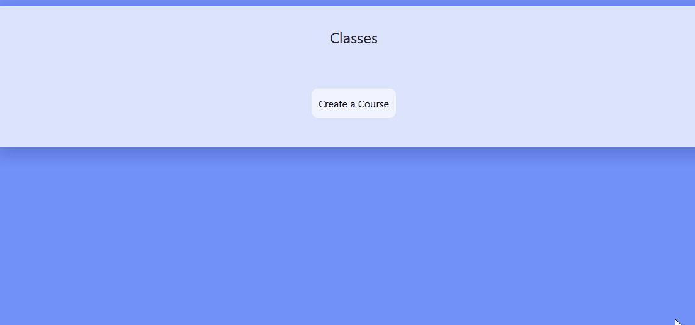
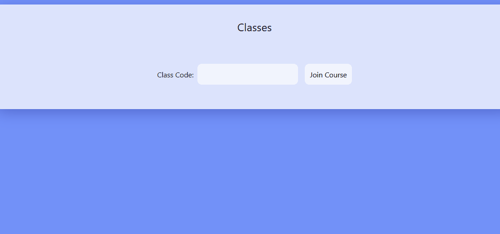

# Lectured

A modern lecture note sharing system.

Visit us [here](http://lectured.herokuapp.com/)!

## Features

### Full-fledged login system

Create real logins that are stored in a database powered by PostGreSQL!

### Course Joining

Have a teacher account create a course, and any student can join it with the class code given by the teacher!

### Lecture Notes

Teachers can share their lecture notes for all their students to see!*
*currently incomplete

### How does it work?

Students and teachers may individually create accounts. **There is no method to recover lost passwords.** Additionally, do NOT reuse passwords on this website. While this website does practice some basic security standards, it is not enough to risk your data over. Here are the credentials of some premade accounts:

**Student account**
- Username: guest
- Password: guest

**Teacher account**
- Username: teacher2
- Password: teacher2

Teacher accounts can **create a course** as shown here:

In turn, students may join the courses using the same course codes (the refreshing of the page in this GIF is done off the recording window):

### Technologies used

- PHP
- PostgreSQL
- Bootstrap
- JavaScript/HTML/CSS

Made for HighTechHacks 2021
Team Hackathoff
Nathaniel D'Rozario
Nishchal Shukla
